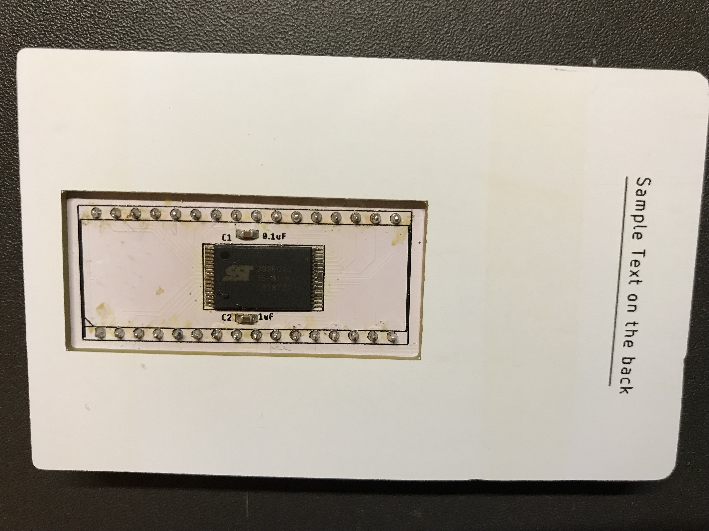
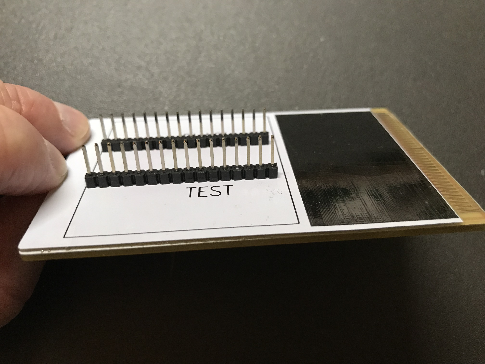
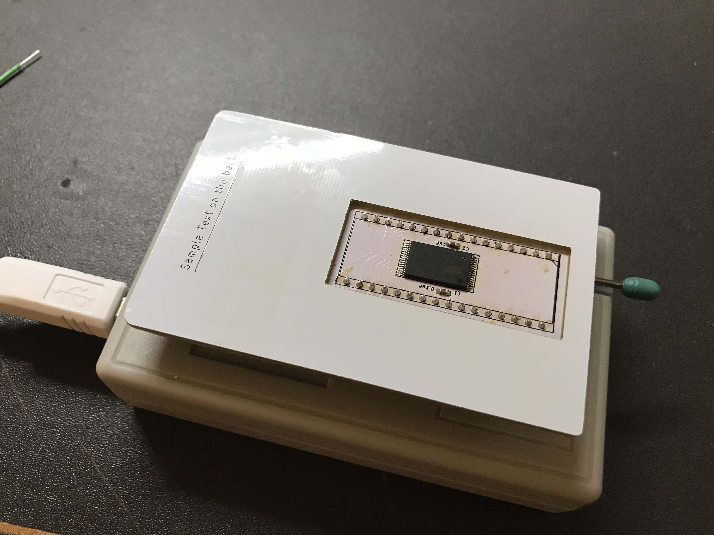

# ProtoHu_revA

ProtoHu was a prototype HuCard I designed, to test the viability of making a
PC Engine HuCard from PC boards.

This version uses an inexpensive 4-megabit Flash memory (SST39SF040), and can
also be programmed by a regular DIP-based EPROM programmer.  Unlike designs such
as the TurboEverdrive, this card is intended for a single program at a time,
and will boot directly to the code, without entering a menu system.

This board was the predecessor to the Megavault design
[github.com/dshadoff/Megavault](https://github.com/dshadoff/Megavault).

As the NOR Flash is rated for 100 years and 100,000 write cycles, there is no
concern about lifetime under the usage in this application.

I designed the boards using the free version of EAGLE (2-layer, less than 100mm
on both X- and Y-axes).  The gerbers are included in this repository as well as
a small EAGLE library of part footprints.

If you decide to get these boards made, I recommend selecting the ENIG option,
which provides a very thin coating of gold plating on all of the exposed metal
areas.  This provides a more flat surface for soldering the memory chip, and
prevents corrossion to some degree over time.  ENIG is by no means comparable
to "hard gold", but it is better than an exposed copper or solder-based surface.

As the boards themselves don't provide to omuch information about how to use them,
here are a few pictures of the orientation of various parts:

## Chip Mounting Orientation:

## Header Mounting Orientation:

## Orientation when programming:

